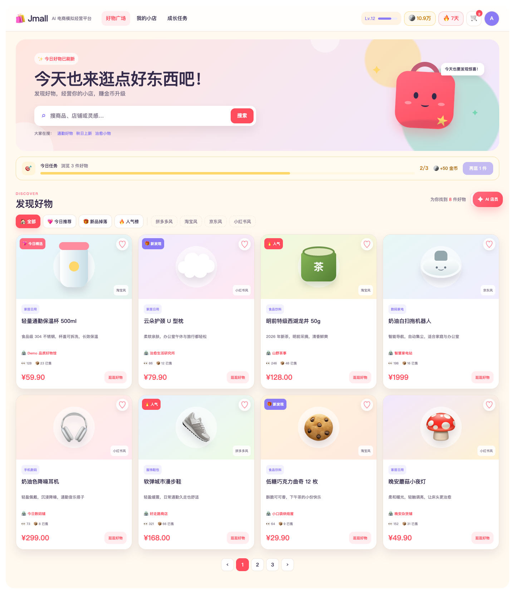
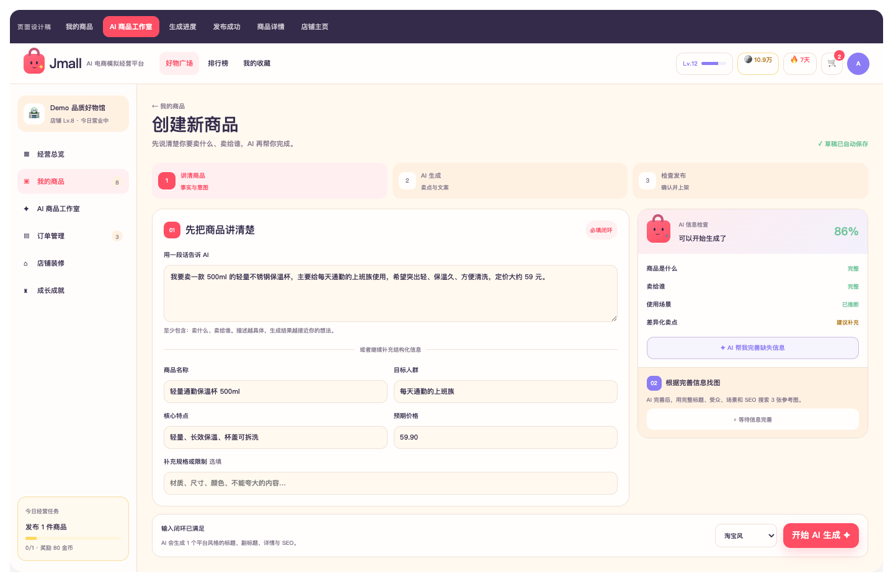
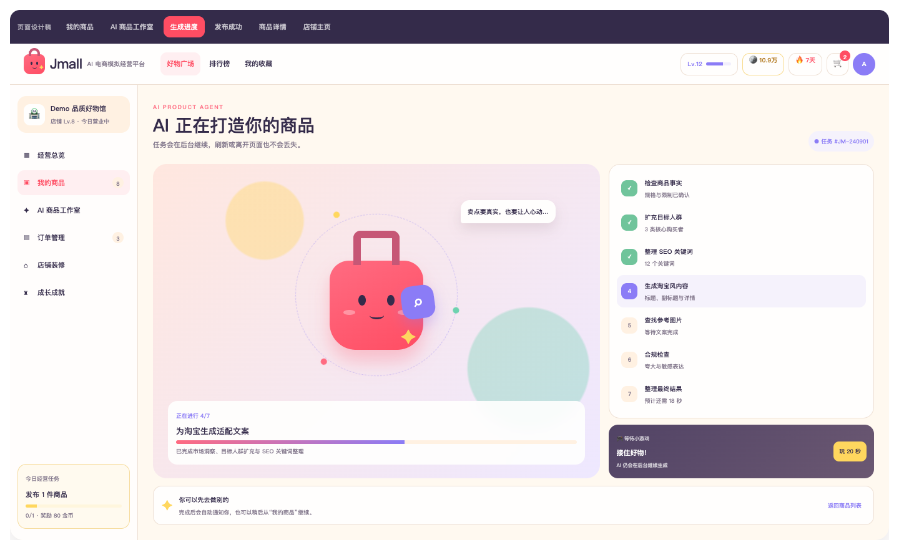
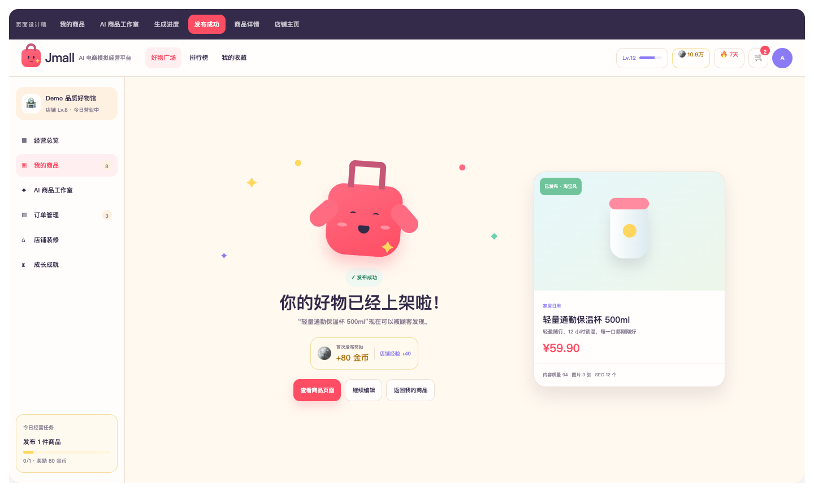
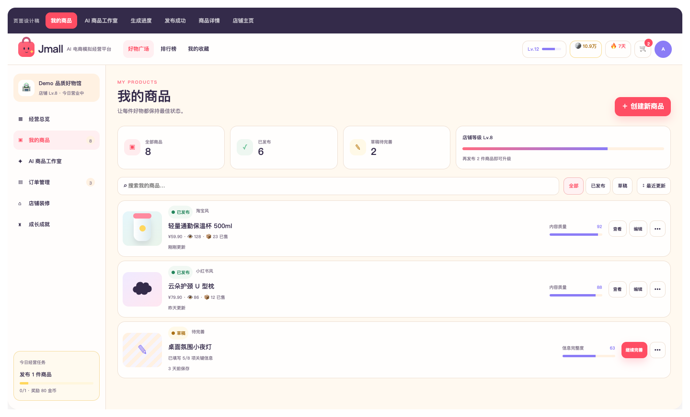
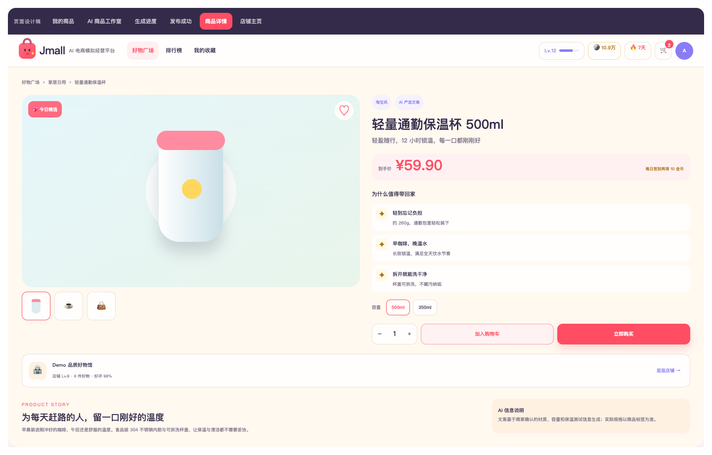
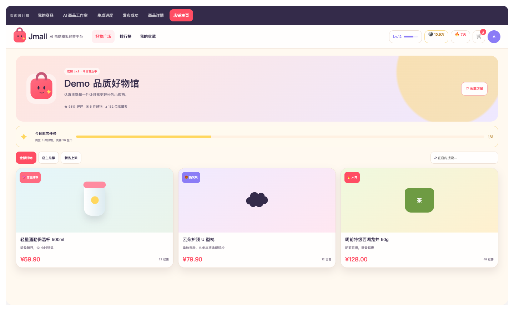

<div align="center">
  

  <h1>Jmall</h1>

  <p><strong>AI 驱动的电商模拟经营平台</strong></p>

  <p>从一句商品想法出发，让 AI 补全信息、生成平台化内容、寻找图片，并陪你完成上架与经营。</p>

  <p>
    
    
    
    
    
  </p>
</div>

<p align="center">
  
</p>

Jmall 把 AI 商品生成、模拟电商经营和游戏化反馈放进同一个产品闭环：商家可以把模糊想法变成可发布商品，买家可以发现商品、与 AI 店员对话，并通过任务和奖励持续经营自己的小店。

## 产品界面

### 从商品想法到正式上架

商家既可以用一段自然语言描述商品，也可以填写结构化表单。系统会先判断信息是否形成完整闭环，再由不同 Agent 完成信息补全、目标人群与 SEO 扩充、平台文案生成、图片候选检索和合规检查。

<table>
  <tr>
    <td width="50%" valign="top">
      
      <br />
      <strong>AI 商品工作台</strong><br />
      自然语言与表单共同描述商品，右侧实时显示信息完整度，并在信息充分后解锁生成与找图。
    </td>
    <td width="50%" valign="top">
      
      <br />
      <strong>可感知的 Agent 生成过程</strong><br />
      市场调研、受众扩充、SEO、平台文案、参考图片与合规检查逐步推进，任务离开页面后仍会继续。
    </td>
  </tr>
  <tr>
    <td width="50%" valign="top">
      
      <br />
      <strong>发布成功与成长奖励</strong><br />
      商品通过门禁后生成发布成功页，并把金币、店铺经验和经营任务反馈给商家。
    </td>
    <td width="50%" valign="top">
      
      <br />
      <strong>可持续编辑的商品资产</strong><br />
      统一管理草稿与已发布商品，查看内容质量，继续编辑、完善或下架。
    </td>
  </tr>
</table>

### 从发现好物到完成购买

买家侧提供商品流、平台风格筛选、AI 店员模糊意图搜索、商品详情、店铺主页、收藏、购物车和模拟支付。用户输入“通勤用”“想找好玩的”这类短线索时，快速模型会先理解意图，再从当前货架给出最多三个选择。

<table>
  <tr>
    <td width="50%" valign="top">
      
      <br />
      <strong>商品详情</strong><br />
      将平台化文案、卖点、规格、价格、店铺和 AI 信息说明组织成清晰的购买决策页面。
    </td>
    <td width="50%" valign="top">
      
      <br />
      <strong>店铺主页</strong><br />
      集中展示店铺等级、经营数据、任务进度和在售商品，连接买家浏览与商家经营。
    </td>
  </tr>
</table>

### 吉祥物与游戏化反馈

<table>
  <tr>
    <td align="center" width="33%">
      
      <br /><strong>AI 正在工作</strong>
    </td>
    <td align="center" width="33%">
      
      <br /><strong>商品正在上架</strong>
    </td>
    <td align="center" width="33%">
      
      <br /><strong>任务完成奖励</strong>
    </td>
  </tr>
</table>

## 项目做了什么

### 商家侧

- 创建和维护商品，管理价格、图片、详情与平台展示风格。
- 商品默认保存为草稿，只有通过服务端信息、图片、确认项和合规门禁后才能发布；发布后可在“我的商品”中继续编辑或下架。
- 通过 AI Agent 完成市场调研、RAG 知识检索、商品文案生成、合规检查和平台风格适配。
- Agent 生成非空商品副标题，并在有联网来源时安全扩充目标人群和 8–12 个 SEO 词；商品事实仍只来自商家确认内容。
- 商品无图时，完成 AI 完善且表单未再修改后，可通过 Image Scout 搜索最多 3 张带来源和风险提示的联网图片候选，由商家确认后使用。
- 通过 SSE 查看 Agent 实时进度，并在页面刷新或网络中断后恢复任务。
- 淘宝、京东、拼多多、苏宁和小红书分别使用独立、带版本的商品 Skill；每次仅生成所选平台的一份主稿，保存后可追溯 Skill 版本。
- 支持完整自然语言描述或结构化表格输入；事实不足时先追问，未确认信息单列，最终平台主稿生成后再进行合规检查。
- 提供独立免费信息检查；食品饮料、服饰鞋包、家居日用、数码家电、美妆护肤和运动户外使用具体追问模板，每次最多三个问题，不强制填满所有示例。

### 买家侧

- 浏览商品和店铺。
- 收藏、加购、下单和模拟支付。
- 通过签到、金币、暴击返利、收藏展示和排行榜体验游戏化购物。

### 技术能力

- Vue 3 + TypeScript 前端。
- Spring Boot + MySQL 主业务服务。
- FastAPI + LangGraph AI Agent 服务。
- PostgreSQL + pgvector RAG 知识库。
- Redis 缓存、任务状态和异步链路支持。
- Go 秒杀热点链路。
- Python 输入检查、单平台生成与图片检索指标，Java 草稿/发布事件与编辑会话漏斗；Grafana 提供 v0.2 产品漏斗面板。Go 指标尚未完整接通。
- Docker Compose 一键部署。

## 环境配置

### 运行要求

- Docker Engine 或 Docker Desktop。
- Docker Compose v2。
- 本机端口 `3000`、`3306`、`5175`、`5432`、`6379`、`9090`、`10301` 和 `19090` 未被占用。Agent 只在 Compose 内网监听，不暴露宿主机端口。

MySQL、PostgreSQL 和 Redis 的主机端口可以通过 `.env` 调整；其余服务端口当前固定在 `docker-compose.yml` 中，冲突时需要修改 Compose 端口映射。

### 创建配置文件

```bash
cp .env.example .env
```

默认配置面向本地演示。数据库密码、Grafana 密码和密钥在非本地环境中必须修改。

### 基础配置

| 环境变量 | 用途 | 默认值 |
|---|---|---|
| `JMALL_MYSQL_ROOT_PASSWORD` | MySQL root 密码 | `jmall123` |
| `JMALL_MYSQL_PORT` | MySQL 主机端口 | `3306` |
| `JMALL_POSTGRES_USER` | PostgreSQL 用户 | `postgres` |
| `JMALL_POSTGRES_PASSWORD` | PostgreSQL 密码 | `jmall123` |
| `JMALL_POSTGRES_DB` | RAG 数据库名 | `jmall_rag` |
| `JMALL_POSTGRES_PORT` | PostgreSQL 主机端口 | `5432` |
| `JMALL_REDIS_PORT` | Redis 主机端口 | `6379` |
| `JMALL_GRAFANA_PASSWORD` | Grafana admin 密码 | `jmall123` |
| `JMALL_JWT_SECRET` | 后端 JWT 签名密钥，至少 32 字节 | 本地开发默认值，非本地环境必须更换为随机值 |

### AI 配置

不配置真实模型密钥时，项目使用 Mock 模式，可完成本地部署和基础流程演示。

平台 Skill 随 Agent 镜像打包，规则与样例位于 `jmall-agent/app/platform_skills/definitions/*.json`，无需额外安装插件或配置密钥。每份规则包含标题预算、关键词布局、语气、详情结构、禁用表达、来源及版本；修改规则时同步递增 `version` 并重建 Agent。标题预算是 Jmall 的编辑约束，不等于各平台所有类目的真实发布限制。当前商品发布指 Jmall 站内发布，不会自动发布到外部电商平台。

| 环境变量 | 用途 |
|---|---|
| `AI_PROVIDER` | 默认模型提供方：`mock`、`deepseek` 或 `qwen` |
| `JMALL_DEEPSEEK_API_KEY` | DeepSeek API Key |
| `DEEPSEEK_BASE_URL` | DeepSeek OpenAI-compatible 地址 |
| `DEEPSEEK_MODEL` | DeepSeek 模型名 |
| `JMALL_QWEN_API_KEY` | 阿里云百炼 Qwen API Key |
| `QWEN_BASE_URL` | Qwen OpenAI-compatible 地址 |
| `JMALL_TAVILY_API_KEY` | Tavily 搜索 API Key |
| `IMAGE_SEARCH_PROVIDER` | Image Scout 图片检索提供方：`qwen`（默认）或 `serpapi` |
| `picture_base` | 图片检索使用的千问模型名；兼容大写 `PICTURE_BASE` 与 `IMAGE_SEARCH_MODEL` |
| `SERPAPI_API_KEY` | 可选的 SerpAPI Key，仅在 `IMAGE_SEARCH_PROVIDER=serpapi` 时用于 Google 图片候选 |

使用 DeepSeek：

```env
AI_PROVIDER=deepseek
JMALL_DEEPSEEK_API_KEY=your-api-key
```

使用 Qwen：

```env
AI_PROVIDER=qwen
JMALL_QWEN_API_KEY=your-api-key
```

Agent 分层路由可以单独配置：

```env
AGENT_STRONG_PROVIDER=
AGENT_STRONG_MODEL=
AGENT_MEDIUM_PROVIDER=
AGENT_MEDIUM_MODEL=
AGENT_CHEAP_PROVIDER=
AGENT_CHEAP_MODEL=
```

留空时使用默认 Provider 和模型配置。

Image Scout 使用千问时复用 `JMALL_QWEN_API_KEY` 和 `QWEN_BASE_URL`：

```env
IMAGE_SEARCH_PROVIDER=qwen
picture_base=qwen-plus-latest
```

`qwen-plus-latest` 是阿里云当前明确支持图文混排的模型；Jmall 已用真实请求验证能够返回通过 HTTPS 与公网 DNS 检查的候选图片。模型若只返回文字或不安全链接，Jmall 会返回明确状态，不会伪造图片。也可以切换为 SerpAPI：

```env
IMAGE_SEARCH_PROVIDER=serpapi
SERPAPI_API_KEY=your-serpapi-key
```

搜索结果只用于展示候选及来源，Jmall 不保证图片使用权，也不会移除水印。

### RAG Embedding 配置

需要导入和检索知识库文档时，应配置真实 Embedding 服务。当前 PostgreSQL 向量列维度为 `1024`，Embedding 输出维度必须保持一致。

以 Qwen OpenAI-compatible Embedding 为例：

```env
RAG_EMBEDDING_PROVIDER=openai-compatible
RAG_EMBEDDING_BASE_URL=https://dashscope.aliyuncs.com/compatible-mode/v1
RAG_EMBEDDING_API_KEY=your-api-key
RAG_EMBEDDING_MODEL=text-embedding-v4
RAG_EMBEDDING_DIMENSION=1024
```

## 部署

### 本地开发启动（默认，支持实时热更新）

```bash
docker compose config --quiet
docker compose up -d --build
```

默认会自动加载 `docker-compose.override.yml`：前端在 Docker 中运行 Vite，并把本机 `jmall-web` 源码挂载到容器。修改 Vue、TypeScript、CSS 或 `src/assets` 后，`http://localhost:5175` 会自动热更新，不需要重新构建前端镜像。首次启动或依赖变化时会自动执行 `npm install`。

MySQL、PostgreSQL、Redis、上传文件、Grafana 和 Agent 本地数据均使用 Docker 命名卷持久化；正常重建容器不会清空数据。修改 `.env` 后使用 `docker compose up -d --build` 让新环境变量进入容器。

### 生产静态部署

生产或生产式验证时仅使用基础 Compose 文件，前端会执行 `npm run build` 并由 Nginx 提供静态文件：

```bash
docker compose -f docker-compose.yml config --quiet
docker compose -f docker-compose.yml up -d --build
```

这种模式不会实时读取源码；代码变化后必须重新构建镜像。恢复本地热更新模式时重新执行 `docker compose up -d --build frontend`。

查看服务状态：

```bash
docker compose ps
```

查看核心服务日志：

```bash
docker compose logs -f frontend backend agent
```

### 访问地址

| 服务 | 地址 |
|---|---|
| Jmall 前端 | http://localhost:5175 |
| Java 后端 API | http://localhost:10301 |
| Agent 健康检查 | `docker compose exec agent python -c "import urllib.request; print(urllib.request.urlopen('http://127.0.0.1:18080/health').read().decode())"` |
| Go 秒杀服务健康检查 | http://localhost:19090/health |
| Prometheus | http://localhost:9090 |
| Grafana | http://localhost:3000 |

Grafana 默认用户名为 `admin`，密码由 `JMALL_GRAFANA_PASSWORD` 配置。

`Jmall v0.2 产品漏斗` 随 Grafana 自动加载；Prometheus 分别采集后端 `/actuator/prometheus` 与 Agent `/metrics`。会话比例按后端进程周期累计，重启清零；客户端上报可能丢失，不等于用户 UV 或发布审计。只有服务端事务提交才计入草稿/发布成功事件。生产部署应限制监控端口访问，勿向公网暴露监控接口。

### 停止

```bash
docker compose down
```

数据库、上传文件和 Grafana 数据保存在 Docker Volume 中，普通 `docker compose down` 不会删除这些数据。
