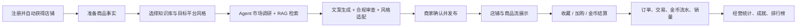
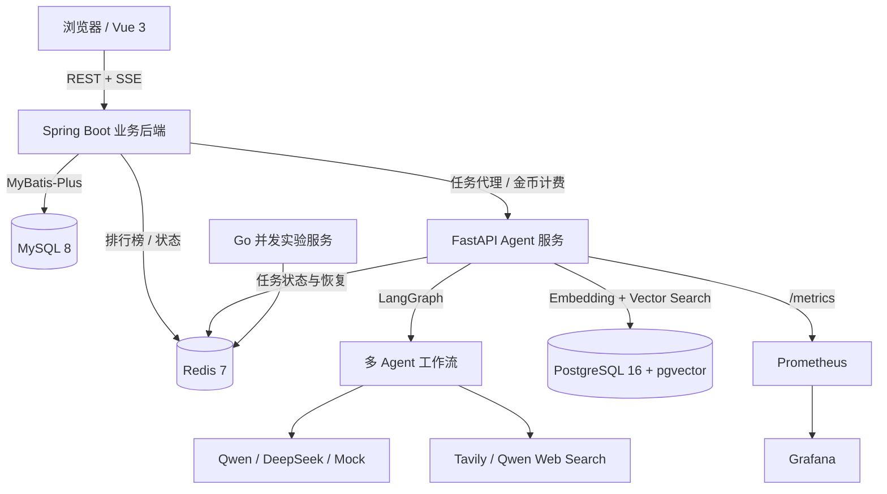
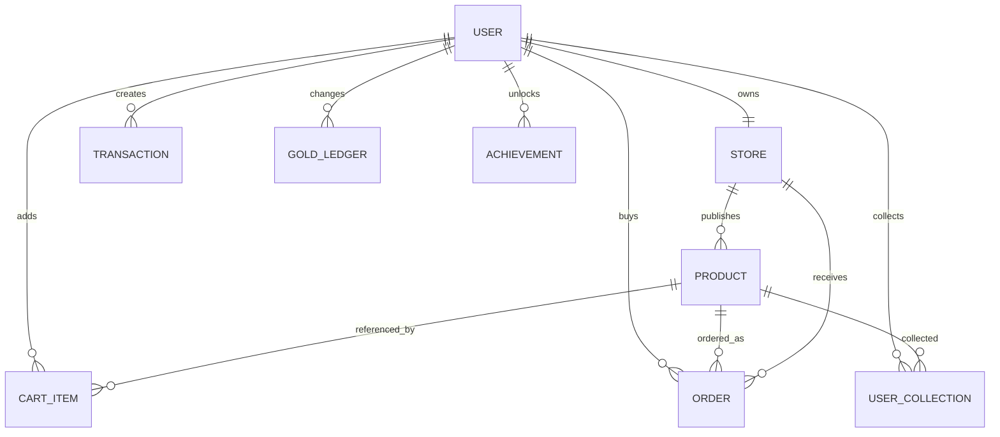
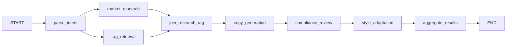
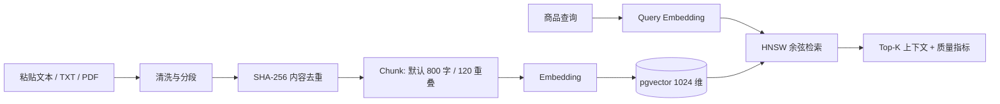

# Jmall 项目素材知识库（秋招简历与面试版）

> 文档用途：供后续 Codex 根据不同岗位 JD，从同一份项目事实中提取简历项目经历、技术亮点、STAR 案例和面试回答。
>
> 当前事实快照：2026-08-14，基于仓库代码、运行中的 Docker Compose 环境、接口返回、自动化测试和历史开发记录交叉核验。
>
> 适配岗位：售前解决方案、测试开发、Agent 开发、运维/DevOps、产品经理、AI 产品经理，以及需要全栈或 AI 工程能力的岗位。

快速导航：`1–3` 项目定位与当前证据；`4–10` 架构、业务、Agent、RAG、可靠性与前端；`11` 问题复盘；`12–15` 测试/运维/售前/岗位素材；`16–18` 指标、路线与面试问答；`19–21` 代码证据、提示词和待补信息。

---

## 0. 使用规则：先读这一节

### 0.1 事实等级

本文用四种标签区分证据强度：

- **[A｜当前已验证]**：2026-08-14 已通过代码、运行服务或测试直接验证，可以用于简历，但仍需确认是否确实由候选人本人负责。
- **[B｜代码已实现]**：当前代码中存在完整实现，但本次没有对所有场景做运行验证。
- **[C｜历史记录]**：来自开发日志、回归记录或用户验收问题，能用于讲开发过程，但不应冒充当前实时指标。
- **[D｜规划/限制]**：尚未实现、只完成实验验证，或不具备生产条件；只能用于讲边界、复盘和后续规划。

### 0.2 给未来 Codex 的硬性约束

生成简历时必须遵守：

1. 不把“项目存在的功能”自动写成“候选人独立完成的功能”。先询问候选人的真实职责、开发周期、团队规模和贡献比例。
2. 不编造 DAU、转化率、收入、QPS、准确率、成本下降百分比、故障恢复时间等仓库中没有实测依据的指标。
3. 可以使用本文“当前验证快照”中的测试数量、服务数量、知识库规模、Agent 节点数量和单次运行观测值，但要带上口径。
4. Jmall 是**模拟经营/工程演示平台**，金币是虚拟经济，不是生产支付系统。
5. Go 秒杀服务目前是独立实验/压测目标，不应写成已接入当前 Java 主业务的生产秒杀链路。
6. “多平台风格”指文案结构与语气适配，不代表与淘宝、京东、拼多多、小红书或苏宁存在官方合作。
7. 市场调研数据必须带来源；RAG 内容只能指导文案结构和风险核对，不能自动变成当前 SKU 的商品事实。
8. 简历 bullet 建议使用“设计并实现 / 参与构建 / 推动修复”等准确动词；是否能使用“主导”必须由候选人确认。

### 0.3 推荐检索关键词

`LangGraph`、`Multi-Agent`、`SSE`、`Redis 任务恢复`、`Qwen`、`Tool Calling`、`RAG`、`pgvector`、`HNSW`、`Embedding`、`Fact Guard`、`合规审查`、`Token 成本`、`Prometheus`、`Grafana`、`Spring Boot`、`MyBatis-Plus`、`Vue 3`、`Pinia`、`Docker Compose`、`JWT`、`购物车`、`订单一致性`、`测试隔离`、`契约漂移`、`售前演示`、`AI 产品闭环`。

---

## 1. 项目一句话与电梯陈述

### 1.1 一句话定位

**Jmall 是一个 AI 驱动的电商模拟经营平台：每个用户既能经营店铺，也能作为买家使用虚拟金币消费；商家可调用多 Agent 工作流完成市场调研、知识库检索、商品文案生成、合规审查和平台风格适配。** [A]

### 1.2 30 秒版本

Jmall 不是传统商品 CRUD，而是把 AI 能力嵌入“商品上架—发布—店铺展示—浏览—收藏—购物车—结算—订单—金币流水”的完整业务闭环。系统采用 Vue 3、Spring Boot、FastAPI/LangGraph、MySQL、PostgreSQL+pgvector、Redis，并用 Docker Compose 编排。AI 侧按任务复杂度路由 Qwen 模型，结合实时搜索、RAG、事实守卫、规则+LLM 合规审查、SSE 进度流和 Redis 任务恢复；同时暴露 token、成本、耗时与预算指标给 Prometheus/Grafana。 [A]

### 1.3 适合写在简历项目名下的短描述

> AI 电商模拟经营平台，覆盖商家智能上架与买家虚拟交易闭环；基于 LangGraph 多 Agent、RAG、实时搜索、Spring Boot 与 Vue 3 构建，并提供任务恢复、成本观测、合规审查和容器化运行能力。

---

## 2. 项目背景、用户与产品价值

### 2.1 要解决的问题

传统电商商家上架商品时存在几个典型痛点：

- 商品资料分散，标题、卖点、详情、规格、SEO 和促销文案需要重复组织。
- 不同平台对内容风格的偏好不同，但风格变化不能突破商品事实边界。
- 市场热词、知识库模板和当前商品属性容易混在一起，造成 AI 幻觉或虚假宣传。
- LLM 调用耗时长、成本不透明，页面跳转或断网后容易丢任务。
- 只做一个 AI 文案 Demo 难以证明业务价值，需要与发布、店铺、购物车、订单和经营数据形成闭环。

Jmall 的产品策略是把上述能力放进一个可演示、可验证的模拟经营环境，用金币经济承担 AI 使用与交易的产品反馈。 [A]

### 2.2 核心用户角色

| 角色 | 主要目标 | 主要能力 |
|---|---|---|
| 商家 | 快速、合规地完成商品上架与店铺经营 | 店铺装修、知识库、Agent 辅助上架、商品管理、经营统计 |
| 买家 | 浏览、收藏、购买商品并获得游戏化反馈 | 商品流、搜索、详情、收藏、购物车、结算、订单、签到、成就、排行榜 |
| 平台运营/管理员（能力侧） | 控制 AI 成本并观察质量 | 成本统计、Prometheus 指标、Grafana 看板、RAG 评估接口 |

### 2.3 产品闭环



---

## 3. 当前可核验成果快照

### 3.1 运行环境 [A]

2026-08-14 本地 Docker Compose 中 9 个服务同时在线：

| 服务 | 作用 | 端口 |
|---|---|---:|
| frontend | Vue 3 前端，由 Nginx 提供静态资源与代理 | 5175 |
| backend | Spring Boot 业务 API 与 AI 代理 | 10301 |
| agent | FastAPI/LangGraph Agent 与 RAG 服务 | 18080 |
| mysql | 用户、店铺、商品、订单等业务数据 | 3306 |
| postgres | `jmall_rag` schema 与 pgvector 向量数据 | 5432 |
| redis | Agent 任务、排行榜缓存及 Go 实验链路 | 6379 |
| bench | Go 秒杀/并发实验服务 | 19090 |
| prometheus | 指标采集 | 9090 |
| grafana | Agent 成本与性能看板 | 3000 |

MySQL、PostgreSQL 和 Redis 配有健康检查；数据库、Redis、Grafana 和商品上传目录使用 Docker Volume 持久化。 [A]

### 3.2 测试与构建快照 [A]

| 层次 | 2026-08-14 实测结果 | 口径 |
|---|---:|---|
| Python Agent | **156 passed** | 在容器内使用隔离的 mock 模型配置执行；另有 32 条依赖弃用 warning |
| Java 后端 | **28 passed** | Maven/JUnit/Spring 测试，0 failure、0 error |
| Vue 前端 | **27 passed** | Vitest，2 个测试文件 |
| API 端到端冒烟 | **13/13 passed** | Shell+curl，覆盖认证、签到、商品、搜索、店铺、资料、成就、排行榜、安全和 AI 代理 |
| 前端生产构建 | **成功** | `vue-tsc` + Vite；存在主包超过 500 KB 的优化提醒 |
| Go | 代码中有 **4 个测试函数** | 本次未执行，不应写成“4 项已通过” |

测试数量说明：这些数字是一次仓库快照，不等于测试覆盖率；当前没有生成可信的覆盖率百分比。前端 27 项主要覆盖 Pinia store，关键页面组件和浏览器 UI 自动化仍需补齐。 [A/D]

### 3.3 RAG 数据快照 [A]

| 知识库 | 文档数 | Chunk 数 | 状态 |
|---|---:|---:|---|
| Jmall 专业经营知识库 | 7 | 7 | 已向量化 |
| 服饰知识库 | 1 | 4 | 已向量化 |
| jmall-demo-kb | 100 | 337 | 已向量化 |

此外仍保留 6 个空的历史/测试知识库。这说明去重逻辑已覆盖“后续新建”，但存量垃圾数据治理尚未完全完成。 [A/D]

专业经营知识库包含：商品信息披露、互联网广告、价格与促销、服装纺织、家电、预包装食品，以及 Jmall 自身的 AI 商品详情与 RAG 使用规范。资料带市场监管总局、国家标准公开系统和国家卫健委等官方来源链接。 [A]

### 3.4 一次真实 Agent 运行的可观测快照 [A]

2026-08-14 当前 Agent 进程的 Prometheus 快照记录了 1 次完整编排涉及的 6 类模型/搜索调用：

- 输入 token：11,579
- 输出 token：3,782
- 总 token：15,361
- 按公开标价估算的当日成本：约 **$0.003509**
- 路由：编排/市场分析/合规使用 Qwen Turbo，风格适配与联网搜索使用 Qwen Plus，核心文案使用 Qwen Max。

该数字只是单次当前进程快照，不是平均性能基准。模型输出长度、搜索结果和商品资料量都会改变 token；供应商免费额度也可能使实际账单低于估算值。 [A]

---

## 4. 总体技术架构



### 4.1 为什么拆成三层应用服务

- **Vue 前端**负责商品编辑、Agent 进度、结果解释和买家/商家体验。
- **Java 后端**持有用户身份、金币和电商业务事实，并作为 AI 网关；这样前端不能绕开业务计费直接调用模型。
- **Python Agent**集中承载 LangGraph、LLM、搜索、RAG 与评估生态，避免在 Java 业务层硬塞 AI 编排逻辑。

这是一种“业务事实归 Java、AI 推理归 Python、交互状态归前端”的职责划分。 [A]

### 4.2 技术栈明细

| 层 | 技术 | 当前用途 |
|---|---|---|
| 前端 | Vue 3.5、TypeScript 6、Vite 8、Pinia 3、Vue Router、Element Plus | SPA、双角色导航、表单、状态管理、组件库 |
| Java | Java 17、Spring Boot 3.2.12、MyBatis-Plus 3.5.9 | REST API、JWT、交易事务、AI 代理 |
| Agent | Python、FastAPI 0.110、LangChain 0.3.7、LangGraph 0.2.39、Pydantic 2 | 多 Agent 编排、SSE、工具调用、RAG |
| 业务存储 | MySQL 8 | 用户、店铺、商品、订单、交易、收藏、成就、金币流水 |
| AI 存储 | PostgreSQL 16、pgvector | 知识库、文档、Chunk、1024 维向量、请求日志结构 |
| 状态/缓存 | Redis 7 | Agent Job、活跃任务索引、排行榜、Go 实验链路 |
| 模型 | Qwen / DeepSeek / OpenAI-compatible / Mock | 分层路由与本地无 Key 测试 |
| 搜索 | Tavily，Qwen 联网搜索回退 | 实时市场调研与来源展示 |
| 可观测 | Prometheus、Grafana | 请求数、token、成本、预算、耗时 |
| 部署 | Docker Compose、Nginx | 本地一键编排与前端托管 |
| 并发实验 | Go 1.22、Redis Lua/Streams | 热点库存、幂等与异步事件实验 |

---

## 5. 业务后端与数据模型

### 5.1 核心数据关系 [A]



关键约束与口径：

- 用户注册后自动创建一对一店铺，并获得初始虚拟金币。 [A]
- 金额在 MySQL 中按“分”存储，结算时以 1 金币约等于 1 元的模拟规则换算。 [A]
- 商品保存标题、副标题、描述、价格、图片、风格、状态、浏览/点赞/销量，以及 AI 标题、卖点、详情、风格预览、市场洞察和合规结果。 [A]
- 购物车按 `(buyer_id, product_id)` 唯一，重复加购累加数量。 [A]
- 收藏、签到、成就均有用户维度唯一约束，减少重复记录。 [A]
- 金币变更同时记录 `gold_ledger`，用于个人中心解释余额来源。 [A]

### 5.2 认证与权限设计

- 登录使用 JWT，密码使用 BCrypt。 [A]
- Spring MVC 拦截器为 GET/OPTIONS 提供 optional-auth，写操作要求 Bearer Token。 [A]
- Service 层对店铺修改、商品删除、Job 查询/消费等操作校验当前用户归属。 [A/B]
- 商品列表、详情和店铺展示允许公开浏览；收藏、购物车、结算、订单和商家能力需要登录。 [A]

**生产边界**：当前实现不是 Spring Security 的声明式权限体系；部分 GET 管理接口和 Agent 直连接口缺少细粒度鉴权，上传路由还被排除在拦截器之外。它适合本地演示，不应被描述为生产级 RBAC。 [D]

### 5.3 商品发布与浏览

- 商品支持创建、编辑、删除、按品类/风格/状态/店铺/关键词分页检索。 [A]
- 关键词搜索覆盖标题、副标题和描述。 [A]
- 商品详情访问会递增真实 `viewCount`，不再用随机倍率伪造热度。 [A]
- 商品流卡片展示标题、副标题、详情摘要、最多两个 AI 卖点、品类、浏览量、销量、店铺和价格。 [A]
- 发布成功后通过完整页面导航回商品管理，避免创建页仍保留旧表单，让用户误以为未发布。 [A]

### 5.4 购物车、结算与订单一致性

正常购物车结算在一个 Spring 事务中执行：

1. 查询当前用户购物车；
2. 校验商品存在且已发布；
3. 校验不能购买自己的店铺商品；
4. 汇总金币成本并校验余额；
5. 一次性扣除买家金币并写流水；
6. 为每个商品创建订单和交易记录；
7. 给卖家增加金币并写流水；
8. 增加商品销量；
9. 清空购物车并返回新余额。 [A]

前端商品详情、购物车和结算页都会识别 `purchasable` 与 `unavailableReason`，在进入后端结算前就提示“不能购买自己店铺的商品”或“商品已下架”；后端仍再次校验，形成前端体验层 + 后端安全层的双重防线。 [A]

直接购买路径也会同时创建 `Transaction` 和 `Order`，从而让工作台销量/订单统计使用同一业务事实来源。 [A]

### 5.5 游戏化机制

- 签到与连续签到奖励；
- 购买、销售、AI 使用、退款、成就奖励都有金币流水类型；
- 8 个成就：首次购买、收藏 10 件、大额消费、连续签到、店主、售出 10 件、夜间购买、大额单笔；
- 消费榜、销售榜、商品榜；
- 商品销售会反馈到店铺统计与排行榜。 [A/B]

游戏化的产品价值是让 AI 成本、商家收益和买家消费形成可见反馈，而不是做真实金融结算。 [A]

---

## 6. Multi-Agent 系统详解

### 6.1 LangGraph 工作流 [A]

当前工作流不是简单顺序调用 5 个接口，而是显式建模依赖：



- 市场调研与 RAG 检索互不依赖，因此并行 fan-out。
- 文案节点必须等二者 join 后执行，保证能同时看到市场上下文与知识库上下文。
- 合规审查在文案之后，风格适配在审查之后，最后聚合部分结果和错误。
- 并行状态使用 reducer 合并；错误列表使用追加 reducer。
- 每次请求用 `ContextVar` 隔离进度回调与成本 scope，避免共享单例在并发请求中串数据。 [A]

### 6.2 Agent 职责

| Agent/节点 | 职责 | 模型层级 |
|---|---|---|
| Orchestrator | 解析意图、生成计划、决定所需步骤 | cheap |
| MarketResearch | 判断是否联网、调用搜索、归纳趋势/关键词/价格带/建议 | cheap |
| RAG Retrieval | 向量检索、生成上下文与检索质量 | 非 LLM 主调用 |
| Copywriter | 生成标题、长详情、卖点、规格、受众、场景、SEO、促销等 | strong |
| Reviewer | 规则检查 + LLM 语义审查 | cheap |
| StyleAdapter | 将事实安全地适配为目标平台语气与结构 | medium |

### 6.3 分层模型路由

路由器按 `agent_type -> cheap/medium/strong` 确定模型层级，再按环境变量选择 provider 和 model。Qwen 默认映射为 Turbo/Plus/Max；DeepSeek 当前默认统一使用 chat 模型；无真实 Key 时可以落到 mock。 [A]

设计价值：

- 核心创意写作使用强模型，简单计划和规则辅助使用低成本模型；
- provider 与 model 可分层覆盖，便于做成本/质量实验；
- 路由是确定性策略，不额外调用一个 LLM 来决定用哪个 LLM；
- mock provider 让 CI 和本地测试不依赖外部模型。 [A]

不能写“成本降低 60%”等百分比，因为当前没有同一数据集下的 A/B 基线。可写“按任务复杂度分层路由，以避免所有节点统一使用高成本模型”。

### 6.4 Tool Calling 与市场调研

MarketResearch Agent 使用 OpenAI-compatible Function Calling：模型可调用 `search_market_trends`，基类最多允许 3 轮工具迭代，将工具结果重新送回模型形成结构化结论。 [A]

搜索可用性链路：

1. 优先 Tavily，最多返回 5 条结果；
2. Tavily 未配置、初始化失败、超时、鉴权失败、限流或返回无效结果时，回退到 Qwen 联网搜索；
3. 两者都不可用时返回明确 `failed` 状态、空来源和错误说明，不伪造“实时趋势”；
4. 最多提取、去重并展示 8 个来源链接，记录 search provider、method、research scope 和 tool history。 [A]

这解决了“右侧写了市场调研，但用户不知道去哪里搜、结果是否真实”的可解释性问题。 [A/C]

### 6.5 文案输出结构

Copywriter 目标输出包括：

- 3 个标题候选；
- 5 个卖点；
- 约 350–900 字的结构化商品详情；
- 副标题；
- 价格建议（只有存在市场依据时才给）；
- 规格、目标人群、使用场景、SEO 关键词、促销文案；
- 30 秒视频脚本；
- 待商家确认项与事实来源标识。 [B]

最终详情的产品结构是：商品概览、核心亮点、适用人群与场景；需要商家确认的规格、认证、材质和数字不再混进可发布详情，而由前端归入“规格参数/待确认”区域。 [A]

### 6.6 平台风格适配

支持拼多多、淘宝、京东、苏宁、小红书五类展示风格。后端可以保留多个预览，但当前编辑页只展示用户选择的目标风格卡片，避免选择淘宝却同时出现其他风格造成认知冲突。展示风格本身由用户选择，因此已取消无意义的“AI 推荐风格”标签。 [A]

风格适配只能调整标题节奏、卖点组织、信息密度和语气，不能凭市场热词发明材质、认证、销量、物流承诺、用户体验或数值。 [A]

### 6.7 规则 + LLM 合规审查

Reviewer 采用混合策略：

- 确定性规则检查广告法高风险词、绝对化表达、标题长度、缺失信息、数字与价格风险；
- LLM 补充语义层面的虚假承诺、过度售卖与不实比较；
- LLM 解析失败时仍返回规则结果；
- 最终状态为 passed、warning 或 rejected，并合并警告和建议。 [A/B]

这种设计避免把合规完全交给概率模型，也避免规则字典无法理解上下文。

### 6.8 Fact Guard：商品事实边界

系统把信息分为三类：

- **A级：商家已输入或有证据的商品事实**，可以改写进入商品页；
- **B级：知识库中的法规、标准和模板**，只能指导结构与风险检查；
- **C级：实时市场调研**，只用于趋势、关键词和运营建议，不能变成当前商品属性。 [A]

Fact Guard 对模型结果做确定性后处理：过滤无证据的认证、功效、绝对化承诺、销量排名和数值，去重卖点，将待确认事实单独保留。重点不是“禁止创意”，而是让创意发生在事实边界之内。 [A]

### 6.9 容错与降级

- 单节点异常写入 `errors`，下游尽量消费结构一致的 fallback，而不是让整条链路永久 loading；
- 市场搜索失败时不生成伪趋势；
- 合规模型失败时规则检查仍可用，并提示人工复核；
- 文案和平台风格均有基于已知商品事实的确定性降级内容；
- 最终聚合返回可用的部分结果、错误列表和成本信息。 [A/B]

---

## 7. RAG 知识库详解

### 7.1 数据链路



### 7.2 导入与去重

- 编辑页支持直接粘贴文本，Java 代理将 JSON 映射到 Agent 的文本导入接口。 [A]
- Agent 还支持 UTF-8 TXT（最大 2 MB）和 PDF（最大 10 MB，抽取文本最多 20,000 字）。 [B]
- 文本先标准化，再按段落优先切分；长段按 overlap 滑窗切分，默认 chunk 约 800 字、重叠 120 字。 [A]
- 清洗后内容计算 SHA-256，同一知识库重复内容直接返回已有文档。数据库再用 `(knowledge_base_id, content_hash)` 唯一索引兜底。 [A]
- 知识库名称按去空格、忽略大小写查询；新建同名库返回已有库并在前端提示“未重复创建”。 [A]
- 当前列表查询还会按规范化名称做分组，降低历史重复数据对 UI 的影响。 [A]

### 7.3 向量检索

- PostgreSQL 使用 `jmall_rag` schema 和 pgvector 扩展；向量列固定为 1024 维。 [A]
- 当前 Qwen embedding 默认模型为 `text-embedding-v4`，也支持 mock 或其他 OpenAI-compatible embedding 服务。 [A]
- 使用 HNSW + cosine operator class 建索引；检索结果按最小分数和 Top-K 过滤。 [A]
- 每个 Chunk 保存文档 ID、索引、字符数、来源文件、标题、类型和 embedding provider 等元数据。 [A]

### 7.4 RAG 质量评估

项目有两层评估：

1. **在线轻量质量**：根据 top1 与平均相似度输出 high/medium/low/empty；当前阈值是 top1 ≥ 0.8 为 high，≥ 0.5 为 medium。 [A]
2. **管理侧评估**：支持 LLM-as-Judge 相关性评分，并计算 Hit Rate、MRR、NDCG、Precision@K；LLM 不可用时使用适配中文的字符重叠算法降级。 [B]

仓库还提供 demo 知识抓取、知识库验证和阈值验证脚本，但脚本存在不等于这些指标已达到某个数值。 [B]

### 7.5 专业知识库建设方式

`seed_professional_knowledge.py` 以幂等方式导入 7 类资料，每篇保留来源 URL、资料类型和适用规则。这样未来可回答“知识从哪里来”“哪条规则影响了文案”，而不是把来历不明的网络内容直接塞进向量库。 [A]

当前专业库只有 7 个 Chunk，广度和颗粒度仍有限；100 文档 demo 库更丰富，但其网络来源质量需要分级审核。 [D]

---

## 8. 长耗时任务、SSE 与断线恢复

### 8.1 原问题

早期 Agent 进度依赖浏览器 SSE 连接：如果模型调用较慢、用户切页、刷新或网络断开，前端只看到某个步骤卡住，任务结果也难以恢复。 [C]

### 8.2 当前方案 [A]

1. Agent 在建立 SSE 后先创建 Redis Job；
2. 首个 SSE 事件是 `job_created`，前端立即保存 `jobId`；
3. 真正的 Agent 运行由 `asyncio.create_task` 在服务端后台继续执行，并保留 Task 引用；
4. 每个节点将进度、部分结果、RAG 质量、最终结果与成本写回 Redis；
5. 前端断线后通过 `GET /jobs/{id}` 轮询，或通过用户活跃任务接口找回最新 Job；
6. 页面刷新后恢复最初提交的商品事实、进度、部分结果和最终结果；
7. 商品发布后调用 consume 接口删除已完成 Job，避免旧结果重新灌入新表单。

Job 状态：`PENDING -> RUNNING -> COMPLETED | FAILED`，TTL 为 1 小时。SSE 包括 `job_created`、`agent_progress`、`orchestration_complete`、`error` 和 `done`，并发送 keepalive，关闭 Nginx buffering。 [A]

Java 代理使用 5 分钟 `SseEmitter`，10 秒连接超时和 300 秒读取超时。只有在 Job 尚未创建前失败才退回 AI 金币；Job 已持久化后即使浏览器断开也不取消、不重复退款，用户可恢复结果。 [A]

### 8.3 仍然存在的边界

- Redis 不可用时 Job 不持久化；
- 每个用户只保留一个“最新活跃任务”索引；
- 后台执行仍是 Agent 进程内的 asyncio Task，不是 Celery/Kafka 等独立 Worker；Agent 进程重启会中断正在运行的计算；
- 1 小时 TTL 后无法恢复；
- 没有跨实例抢占、幂等消费和分布式调度。 [D]

因此准确表述是“实现断开连接与页面刷新后的任务恢复”，而不是“实现了任意故障下的分布式任务可靠执行”。

---

## 9. Token、成本与可观测性

### 9.1 为什么早期页面显示 Token 很多但成本为 0

可能有三种不同口径：

- mock 模型的价格就是 0；
- 早期模型名没有命中价格表或模型调用未完整上报 usage；
- UI 只保留 4 位小数，极小的美元估算值会显示 `$0.0000`。 [A/C]

当前 CostTracker 会记录 provider、model、input/output token、Agent 类型、scope 和估算成本，并明确标注成本依据为“免费额度前的公开标价估算”，不是供应商账单。 [A]

### 9.2 可观测指标 [A]

Prometheus 指标包括：

- `agent_requests_total{agent_type,provider,model}`
- `agent_tokens_total{agent_type,direction}`
- `agent_cost_total_usd{agent_type}`
- `agent_cost_daily_usd`
- `agent_budget_daily_usd`
- `agent_over_budget`
- `agent_request_duration_seconds{agent_type,provider}`

Grafana 看板展示当日/累计成本、请求数、预算使用率、Agent 成本速率、输入/输出 token 速率、按 Agent 的请求/token 分布和时延热力图。 [A]

### 9.3 成本机制边界

- 价格表是代码内的估算，供应商改价后可能过期；
- CostTracker 明细保存在进程内存，进程重启会丢失明细，Prometheus Counter 也会从新进程重新累计；
- 每日预算当前只告警，不会阻断请求；
- Java 金币扣费是产品内虚拟成本，不等于美元模型成本；
- 当前还没有租户配额、账单对账和持久化成本仓库。 [D]

---

## 10. 前端与交互设计

### 10.1 双角色路由

买家侧包含商品流、详情、排行榜、购物车、结算、订单、收藏、成就和个人中心；商家侧包含工作台、商品管理/编辑、店铺装修和知识库。用户可以在两种角色体验间切换。 [A]

### 10.2 Agent 编辑器的产品设计

商品表单不只接收标题和价格，还包含：

- 副标题、长详情、规格参数；
- 目标人群、使用场景；
- SEO 关键词、促销文案；
- 商品图片与目标平台风格；
- AI 卖点、市场洞察、合规结果和风格预览。 [A]

右侧 Agent 面板展示步骤进度、RAG 质量、市场来源、平台风格卡片、合规状态、token 和成本。关键原则是：**右侧负责解释与选择，左侧表单负责形成最终可发布事实**。 [A]

### 10.3 近期体验修复 [A/C]

- AI 结果原本只在右侧展示、几乎不进入详情：改为生成结构化长详情并回填表单。
- “请商家确认规格”等运营提示混入商品详情：改为从发布内容过滤，集中归入规格/待确认区。
- 选择淘宝风却同时看到多个平台卡片：只展示所选目标风格。
- “展示风格”旁边出现多余 AI 推荐：移除，因为风格是用户显式选择。
- 商品流只显示名称与品类：增加副标题、详情摘要和卖点标签。
- 发布后仍留在原表单：强制完整导航回商品管理，并携带发布/更新通知。
- 工作台“已上架商品”只显示数字：卡片可点击进入自己的店铺。
- 自己的店铺缺少返回入口：增加“返回商家中心”。
- 本地图片上传失败：统一上传目录、静态资源映射、Volume 和前后端校验。
- 粘贴知识库文本失败：Java 代理改为正确 JSON 路由并解析 Agent 响应。
- 同名知识库大量出现：创建时规范化名称并返回已有记录，内容再按 hash 去重。

这些修复体现 AI 产品的一个核心判断：模型“生成了内容”不等于用户“获得了可用结果”，必须把生成、解释、选择、回填、确认和发布串成闭环。

---

## 11. 开发问题复盘：根因、修复与岗位价值

| 问题 | 根因 | 修复 | 可讲能力 |
|---|---|---|---|
| Agent 长时间停在意图解析/切页丢任务 | 长耗时执行与 SSE 客户端生命周期绑定，缺少服务端状态 | Redis Job + 后台 Task + jobId + 轮询恢复 + consume | Agent 工程、可靠性、状态机 |
| AI 有输出但详情仍是原文 | 结果展示与表单写入分离，风格预览字段契约不统一 | 统一发布内容构建函数，回填长详情、卖点和扩展字段 | AI 产品闭环、前端状态 |
| 待确认提示污染详情 | 安全提示与消费者可见文案混在同一字段 | 发布详情过滤确认项，确认项归规格区 | 内容治理、信息架构 |
| 选择一种风格却显示五种 | 后端多预览能力直接映射到 UI，没有服从用户选择 | 当前 UI 只筛选目标风格 | 产品决策、降噪 |
| 市场调研不可用/无来源 | Tavily 单点依赖，失败时缺少诚实状态和来源元数据 | Tavily -> Qwen fallback，来源、方法、scope 和失败状态 | Tool Calling、可解释 AI |
| Token 很多但成本为 0 | mock/模型价格映射/usage/显示精度口径不一致 | 分 Agent token 与估算成本、Prometheus/Grafana、成本基准说明 | FinOps、可观测性 |
| 图片上传本地失败 | 容器路径、静态映射和持久化目录不统一 | 绝对上传目录、`/uploads/**` 映射、Volume、5 MB 类型校验 | 全栈排障、容器存储 |
| 粘贴知识库上传失败 | Java Proxy 与 FastAPI 路由/请求格式不一致 | JSON 文本导入代理、结构化响应解析 | 微服务契约测试 |
| 知识库重复 | 名称和内容都缺少稳定去重口径 | 忽略大小写/空格的名称复用 + SHA-256 + DB 唯一约束 | 数据治理、幂等 |
| 发布成功后页面像没变化 | 创建页与管理页路由复用，同路由跳转未重置状态 | 完整页面导航并消费 Agent Job | 用户反馈、状态清理 |
| 自己商品进入购物车后结算报错 | 商品所有权约束只在购买末端暴露，前端缺少可购买状态 | 加购、购物车、结算和后端四处一致校验并返回中文原因 | 防御式设计、异常体验 |
| 工作台统计不可信 | 早期硬编码/口径分散 | 从 published 商品和有效订单实时聚合 | 数据口径、产品可信度 |
| `/stores/mine` 用户上下文为空 | `excludePathPatterns('/api/stores/**')` 误排除认证子路径 | optional-auth 拦截器 + 缩小排除范围 | Spring 排障、安全测试 |
| Java 调 Agent 全部 404 | 对外 `/api/ai/*` 与内部 FastAPI 路由混淆 | 代理层显式做路径翻译，并补测试 | 跨语言 API 契约 |
| Agent 启动报 state key 冲突 | LangGraph 0.2 中节点名与 state key 共享命名空间 | 节点改为 `node_market_research`，保留广泛使用的 state key | 框架升级、最小改动 |
| PostgreSQL 查询旧 schema | 项目从 Jrunmall 重构后默认配置仍引用旧名称 | 默认 schema 统一为 `jmall_rag` | 配置治理、迁移排障 |
| 前后端成就不一致 | 同一领域枚举在多处独立演进，且 `COLLECTOR_10` 名称与行为不符 | 统一为 8 个定义，收藏按收藏表统计 | 契约漂移、测试思维 |
| Agent 测试受真实 Qwen 配置污染 | Docker 运行环境的 tier override 覆盖了测试 mock 预期 | 测试执行时显式清空 tier provider/model 并设置 mock | 测试隔离、外部依赖治理 |

### 11.1 最适合讲 STAR 的三个案例

#### 案例 A：Agent 任务断线恢复

- **S**：模型调用耗时长，网络断开或切换页面后，用户看到任务卡住且无法判断是否继续执行。
- **T**：让任务与浏览器连接解耦，同时防止重复扣费、重复执行和旧结果污染新表单。
- **A**：设计 Job 状态机；SSE 首包返回 jobId；Redis 保存输入、进度、部分结果、最终结果和成本；后台 Task 独立执行；前端本地保存 jobId 并轮询恢复；发布后消费 Job。
- **R**：当前可在断开 SSE、刷新和页面跳转后恢复 1 小时内的活跃任务；Agent SSE/JobStore 相关测试纳入 156 项 Python 测试集。
- **复盘**：进程重启仍会中断，应进一步引入独立 Worker 和消息队列。

#### 案例 B：AI 文案“有结果但不可用”

- **S**：Agent 右侧输出很多内容，但详情仍接近商家原文；确认提示甚至直接显示给消费者。
- **T**：把“生成能力”转化为“可编辑、可解释、可发布”的用户价值。
- **A**：定义结构化详情；区分 publishable content 与 pending confirmations；只展示用户选择的风格；回填副标题、卖点、详情、受众、场景、SEO；保持商家最终确认权。
- **R**：当前发布内容能形成多段详情，确认项单独归档，商品流同步展示副标题/摘要/卖点。
- **复盘**：后续应建立人工评分集，量化“信息增量、事实一致性、风格区分度”。

#### 案例 C：从搜索单点到可解释市场调研

- **S**：Tavily 不可用时调研功能瘫痪，用户也不知道模型查询了什么来源。
- **T**：提升搜索可用性，同时杜绝无来源趋势被当作事实。
- **A**：用 Tool Calling 触发搜索；加入 Qwen 联网搜索回退；抽取去重链接；输出 provider、method、scope、source_count；全失败时返回明确 failed，而不是 mock 趋势。
- **R**：当前真实运行快照中可以分别看到 web search 的 token、模型、成本和来源链路。
- **复盘**：后续需要来源可信度分级、时效性校验和搜索结果缓存。

### 11.2 开发演进时间线 [C，当前结果已复核]

| 阶段 | 主要工作 | 代表性问题/决策 |
|---|---|---|
| 项目收敛 | 从历史 Jrunmall/Gulimall 代码中收敛出 Jmall，建立 Vue、Spring Boot、FastAPI、三类存储与 Compose 架构 | 清理遗留模块时出现旧 schema、旧路径和旧命名残留 |
| 核心闭环 | 补注册、店铺、商品、搜索、签到、金币、交易、收藏、成就与排行榜 | 发现认证路径过度排除、前后端数据解包和成就契约漂移 |
| Agent 基础 | 建立多 Agent、分层路由、RAG、Fact Guard、AI Proxy 和 mock-first 测试 | LangGraph 状态键冲突、微服务 API 路由不一致、模型 JSON 鲁棒性 |
| 体验打磨 | 店铺装修、图片上传、风格预览、购买反馈和 loading/error/empty 状态 | 本地上传目录与容器路径不一致，AI 预览没有真正回填表单 |
| 工程增强 | 市场/RAG 并行、SSE、Redis Job、RAG 评估、Prometheus/Grafana | 长任务与浏览器连接绑定，token/成本口径不透明 |
| 用户验收修复 | 依据实际页面体验修复详情内容、风格筛选、知识库、发布反馈、店铺导航和自购结算 | 从“接口成功”转向“用户是否看见、理解并能完成下一步”的产品验收 |

这条时间线适合回答“项目是如何从能运行发展到能演示、能解释、能复盘的”。其中具体日期和个人负责范围仍需候选人补充。

---

## 12. 测试开发视角素材

### 12.1 当前测试体系

| 层 | 测试重点 |
|---|---|
| Agent 单元/组件 | Agent 输出、路由、provider、tool calling、Fact Guard、chunking、embedding、RAG、质量评估、成本、metrics、JobStore、SSE |
| Java 单元/Web 层 | AI Proxy 请求/响应与 SSE、图片落盘、金币变更、购物车所有权 |
| 前端单元 | 认证与游戏化 Pinia store |
| API 冒烟 | 登录、签到、公开/认证接口、搜索、Profile、金币流水、成就、排行榜、安全、AI styles/KB |
| 数据层 | pgvector schema、索引、Repository 行为与去重 |

### 12.2 有代表性的测试思想

- **契约测试**：Java camelCase 到 Python snake_case、代理路径、JSON 解包、SSE 事件结构。
- **配置边界测试**：mock provider 必须不被真实 API Key 或 tier override 污染。
- **降级测试**：搜索/LLM/Redis 不可用时，应返回诚实状态或结构一致的 fallback。
- **安全边界测试**：不能购买自己的商品；无 Token 写接口返回 401；Job 只能由所属用户查询/消费。
- **数据幂等测试**：同内容 hash 不重复导入，同名知识库不重复创建。
- **AI 质量测试**：相关性、Hit Rate、MRR、NDCG、Precision@K，以及规则+LLM 合规检查。

### 12.3 测试缺口 [D]

- 缺少 Playwright/Cypress 浏览器级自动化；现有 13 项脚本是 API 冒烟，不是完整 UI E2E。
- 前端组件测试未覆盖 ProductEditor、ProductFeed、Cart 和 Checkout。
- Java Testcontainers 依赖已声明，但当前 28 项测试主要是 mock/Web 单测，未形成完整 MySQL/Redis 集成套件。
- 没有覆盖率门禁、CI pipeline、性能基线和混沌测试。
- Go 代码中的 4 个测试本次未执行。
- Agent 测试出现 Pydantic v2 Field 参数与 httpx TestClient 的弃用 warning，需要升级清理。

---

## 13. 运维、DevOps 与可靠性视角素材

### 13.1 已实现 [A/B]

- Docker Compose 编排 9 个服务；
- MySQL/PostgreSQL/Redis 健康检查与依赖启动顺序；
- 业务库、向量库、Redis AOF、Grafana、商品图片持久化 Volume；
- Nginx 承载前端并代理 API/上传资源；
- Prometheus 抓取 Agent 指标，Grafana 自动 provisioning 成本看板；
- Agent、Java 后端和前端容器支持 restart policy；
- `.env.example` 提供 provider、模型层级、Embedding 和数据库配置入口；
- mock 模式允许无外部 API Key 启动核心演示。

### 13.2 可讲的运维判断

- 将数据库就绪作为服务启动依赖，降低 Compose 冷启动时连接失败；
- 将上传目录挂载 Volume，解决容器重建后图片丢失；
- SSE 关闭代理缓冲并设置 keepalive，避免长连接被中间层误判空闲；
- 指标按 Agent/provider/model 打标签，可以定位是调用频率、模型路由还是输出长度造成成本变化；
- Redis 排行榜更新采用 best effort，不阻塞核心交易，但需要后续补偿/重建机制。

### 13.3 生产化缺口 [D]

- 只有本地 Compose，没有 Kubernetes、云部署、弹性伸缩、蓝绿/金丝雀发布；
- 没有 CI/CD、制品仓库、自动回滚、SLO、告警通知和集中日志；
- Compose 中部分镜像使用 `latest`，不利于可重复部署；
- 默认开发密码与 JWT secret 必须在生产环境替换，所有 API Key 应使用 Secret Manager 管理并定期轮换；
- CORS 当前过宽，且上传接口未强制登录；
- Agent Job 尚未使用独立 Worker/Queue；
- 成本指标没有持久化长期存储；
- 没有 HTTPS、WAF、限流、审计日志和备份恢复演练。

---

## 14. 售前解决方案视角素材

### 14.1 可展示的解决方案故事

客户问题可以抽象为：商家资料不完整、内容生产慢、平台风格不同、合规风险高、AI 成本不可控。Jmall 的解决方案不是只卖一个模型调用，而是：

1. 用知识库沉淀行业规则与商品资料；
2. 用市场搜索补充外部趋势，但保留来源；
3. 用多 Agent 分工生成、审查和适配；
4. 用 Fact Guard 阻止外部知识污染 SKU 事实；
5. 用 SSE/Job 恢复提升长任务体验；
6. 用 token/cost 看板让客户理解使用成本；
7. 用商品发布、店铺和交易闭环证明 AI 结果进入真实业务动作。

### 14.2 售前 Demo 建议顺序

1. 展示专业知识库及来源；
2. 输入一份不完整但真实的商品资料；
3. 选择淘宝或京东风格并启动 Agent；
4. 展示市场来源、RAG 质量、Agent 进度和 token；
5. 将目标风格文案应用到表单，解释待确认项为什么没有进入详情；
6. 发布商品并从工作台进入店铺；
7. 换买家账号浏览、收藏、加购和结算；
8. 回到商家侧查看销量、订单和金币流水；
9. 最后主动说明生产化边界与扩展路线。

### 14.3 售前常见问答

**Q：为什么不用一个大模型一次生成所有内容？**  
A：市场、知识检索、创意文案、合规和风格适配的成本与风险不同。拆分 Agent 可以独立路由模型、观测成本、局部降级和定位问题。

**Q：AI 会不会把网上信息写成我的商品参数？**  
A：系统按商家事实、知识库规则、市场信息三层隔离；市场和 RAG 默认不能成为当前 SKU 事实，Fact Guard 和合规节点会再次过滤。

**Q：Tavily 挂了怎么办？**  
A：回退到 Qwen 联网搜索；两者都失败时明确告知调研不可用，不生成伪实时结论。

**Q：断网后任务是否丢失？**  
A：已创建的 Job 会继续运行，1 小时内可通过 Redis 状态恢复；但 Agent 进程重启仍需后续用独立 Worker 解决。

**Q：如何控制成本？**  
A：按任务复杂度路由模型，逐 Agent 记录 token 与估算成本，Prometheus/Grafana 观察预算；当前预算是告警型，生产版可再加硬配额和租户账单。

---

## 15. 分岗位素材映射

### 15.1 Agent 开发岗

优先关键词：`LangGraph`、`并行 fan-out/join`、`Tool Calling`、`RAG`、`Fact Guard`、`SSE`、`Redis Job`、`ContextVar`、`模型路由`、`成本追踪`、`降级`。

可选简历 bullet：

- 设计并实现基于 LangGraph 的多 Agent 商品上架工作流，将市场调研与 RAG 检索并行执行，并串联文案生成、合规审查和平台风格适配，支持节点级降级与部分结果聚合。
- 构建 Tavily/Qwen 联网搜索回退与来源追踪，通过 Tool Calling 输出搜索 provider、方法和来源链接；结合 Fact Guard 隔离商家事实、RAG 规则与市场趋势，降低无依据商品声明风险。
- 将长耗时 Agent 调用改造为 SSE + Redis Job 模式，保存输入、进度、部分结果、成本和最终结果，使页面刷新或连接中断后可恢复 1 小时内任务。
- 实现 Qwen Turbo/Plus/Max 分层路由与逐 Agent token/成本/延迟指标；当前一次完整运行观测到 15,361 token、估算成本约 $0.003509（仅为单次快照）。

### 15.2 测试开发岗

优先关键词：`配置隔离`、`契约测试`、`SSE 测试`、`RAG 指标`、`幂等`、`mock`、`回归脚本`、`边界测试`。

可选简历 bullet：

- 建立 Agent、Java、前端与 API 冒烟分层测试，当前快照分别通过 156、28、27 和 13 项测试，覆盖模型路由、工具调用、RAG、成本、SSE、上传、金币与认证等关键链路。
- 针对 Java/Python 微服务契约补充路由、字段命名、JSON 解包和 SSE 事件测试，修复代理 404、camelCase/snake_case 映射和响应二次包装问题。
- 设计 AI 依赖隔离方案，排查真实 Qwen tier 配置污染 mock 测试的问题；通过显式清理 provider/model override 保证测试可重复、无外部计费。
- 为 RAG 建立在线相似度分级与 LLM-as-Judge 评估能力，支持 Hit Rate、MRR、NDCG、Precision@K，并提供无模型时的中文字符重叠降级。

### 15.3 运维/DevOps 岗

优先关键词：`Docker Compose`、`healthcheck`、`Volume`、`Prometheus`、`Grafana`、`SSE`、`Redis`、`环境变量`、`可观测性`。

可选简历 bullet：

- 使用 Docker Compose 编排前端、Java、Agent、MySQL、PostgreSQL+pgvector、Redis、Go、Prometheus 和 Grafana 共 9 个服务，配置健康检查、启动依赖与持久化 Volume。
- 为 Agent 暴露按 agent/provider/model 维度的请求、token、成本、预算和延迟指标，并通过 Grafana provisioning 构建成本与性能看板。
- 解决容器内本地图片上传丢失问题，统一绝对存储目录、Spring 静态资源映射和 Docker Volume；配合 Nginx 提供 `/uploads/**` 访问。
- 对长连接链路设置 SSE keepalive、禁用代理缓冲并结合 Redis 状态恢复，提升网络抖动和页面切换场景的可用性。

### 15.4 产品经理岗

优先关键词：`双角色`、`核心闭环`、`游戏化`、`需求优先级`、`数据口径`、`用户反馈`、`异常状态`。

可选简历 bullet：

- 设计“每个用户既是商家也是买家”的双角色模拟经营闭环，将 AI 上架、商品发布、店铺展示、收藏加购、金币结算、订单和排行榜串成可演示流程。
- 基于真实体验识别“AI 有输出但不可用”的关键问题，推动结构化长详情回填、待确认信息分区、目标风格单选展示和发布后状态清理。
- 将工作台统计从硬编码调整为 published 商品与有效订单的统一口径，并完善商品卡片副标题、摘要、卖点和店铺跳转，提高经营数据可信度。
- 通过金币消耗、销售收益、签到、成就和排行榜设计游戏化反馈，同时明确其为模拟经济而非真实支付。

### 15.5 AI 产品经理岗

优先关键词：`AI UX`、`Human-in-the-loop`、`事实边界`、`来源`、`成本解释`、`失败状态`、`评估`。

可选简历 bullet：

- 将 AI 能力拆解为调研、检索、生成、审查、风格适配和发布六个用户可感知阶段，右侧解释过程、左侧承载最终表单，保留商家确认权。
- 建立商家事实/RAG 规则/市场趋势三级信息边界，将待确认参数从消费者详情中剥离，避免 AI 通过知识库或搜索结果虚构 SKU 属性。
- 为市场调研补充 Tavily/Qwen 回退、来源链接和失败状态，为成本面板补充 token、模型、估算依据，提升 AI 结果的可解释性与信任。
- 规划并实现 RAG 质量分级和 LLM-as-Judge 指标框架，为后续离线评测、Prompt/模型 A/B 和知识库治理提供基础。

### 15.6 售前解决方案岗

优先关键词：`需求抽象`、`方案架构`、`PoC`、`演示闭环`、`风险边界`、`客户价值`。

可选简历 bullet：

- 将商家内容生产慢、平台风格差异、合规风险和成本不透明等需求抽象为 Multi-Agent + RAG + 实时搜索 + 可观测的整体方案，并通过完整电商闭环验证落地价值。
- 设计可追溯演示路径：专业知识库来源、Agent 进度、市场链接、RAG 质量、文案回填、发布与买家结算均可在同一 PoC 中展示。
- 在方案中主动呈现事实守卫、搜索降级、任务恢复和生产化边界，能够向客户解释“为什么可信、失败怎么办、成本如何看、下一步如何扩展”。

---

## 16. 可量化事实清单

以下数字可以使用，但必须保留口径：

- 5 种平台文案风格；
- 5 个专业 Agent 角色，加 1 个 RAG 检索节点和 1 个 join 节点；
- 9 个 Docker Compose 服务；
- 3 类模型复杂度层级；
- 2 类实时搜索 provider（Tavily、Qwen）构成回退链；
- 1024 维 pgvector 向量；
- 默认 Chunk 800 字、Overlap 120 字；
- Job TTL 1 小时；
- 文本文件上限 2 MB、PDF 10 MB、图片单张 5 MB且前端最多 6 张；
- 当前主专业库 7 文档，demo 库 100 文档/337 Chunk；
- 当前测试快照：Python 156、Java 28、前端 27、API 冒烟 13 均通过；
- 当前一次完整 Agent 运行快照：6 类模型/搜索调用、15,361 token、估算 $0.003509。

不能直接使用：

- “准确率 95%+”“成本下降 60%”“响应速度提升 80%”；
- “支持百万 QPS”“零故障”“生产级高可用”；
- “测试覆盖率超过 60%”；
- “接入淘宝/京东官方 API”；
- “已经上线公有云/Kubernetes”；
- “Go 秒杀已接入当前 Java 订单链路”。

---

## 17. 当前技术债与下一阶段路线

### 17.1 P0：安全与数据一致性

- 上传、成本管理、Job 查询和 Agent 直连接口补鉴权/RBAC；
- 收紧 CORS，加入 CSRF/限流/文件内容检测；
- 所有密钥迁移到 Secret Manager 并建立轮换机制；
- 金币扣减使用原子 SQL/乐观锁，订单加入幂等键；
- 排行榜与主库建立可重建/补偿机制；
- 清理历史空知识库并建立管理员数据治理入口。

### 17.2 P1：Agent 生产可靠性

- 将进程内 Task 迁移到 Celery/RQ/Kafka 等独立 Worker；
- 增加重试、退避、死信、幂等和任务租约；
- 成本记录写入持久化存储，预算支持按用户/租户硬限制；
- 建立 Prompt/模型版本与结果审计；
- 搜索来源做可信度、时效性和重复内容评分。

### 17.3 P1：测试与质量

- Playwright 覆盖“注册—AI 上架—发布—换账号购买—经营统计”；
- ProductEditor、商品流、购物车和结算组件测试；
- Testcontainers 覆盖 MySQL/Redis/PostgreSQL；
- 建立真实商品评测集，衡量事实一致性、风格区分度、详情信息增量和合规召回；
- 建立性能基线、故障注入和覆盖率门禁。

### 17.4 P2：部署与性能

- CI/CD、固定镜像版本、SBOM/漏洞扫描；
- HTTPS、API Gateway、集中日志、告警、备份恢复；
- 前端路由/组件代码分割，优化当前大于 500 KB 的主包；
- 引入缓存与批量查询，减少购物车/订单列表的 N+1 查询；
- 明确 Go 秒杀实验与 Jmall 主订单的边界，若保留则重建事件消费者与补偿链路。

---

## 18. 面试追问与回答要点

### 18.1 为什么用 LangGraph，而不是手写 if/else？

因为工作流有并行节点、join 依赖、条件边、共享状态、部分失败和进度回调。LangGraph 把拓扑与状态合并显式化，便于测试和扩展；代价是需要处理 state reducer、节点命名约束和框架升级兼容。

### 18.2 为什么 RAG 不能直接给商品补参数？

知识库描述的是通用规则或其他资料，不一定属于当前 SKU。直接补参会把“相似商品事实”错误地提升为“当前商品事实”。因此 RAG 只指导结构、风险和待确认字段；只有商家输入或有证据的资料才能进入可发布事实。

### 18.3 为什么同时要规则审查和 LLM 审查？

规则可重复、可解释，适合绝对词、长度和已知模式；LLM 能理解语义和隐含承诺，但概率性强。两者结合能让规则作为最低安全线，LLM 扩大语义覆盖，任一侧失败仍可返回部分审查结果。

### 18.4 为什么 Job 放 Redis？

需要让任务状态跨浏览器连接和页面生命周期存在，并支持按用户找回。Redis 适合 TTL 状态和快速轮询；但它只解决状态持久化，不能替代独立 Worker，因此进程重启恢复执行仍未解决。

### 18.5 当前最危险的并发问题是什么？

金币余额是读取后更新，缺少数据库级原子扣减/版本号；高并发结算可能出现超扣或覆盖。订单也没有业务幂等键。生产化时应使用条件更新、乐观锁或账户流水驱动，并为结算请求设计幂等 token。

### 18.6 为什么成本是估算而不是账单？

系统从模型 usage 获取 token，再按代码中的公开标价估算；供应商免费额度、缓存计价、促销和改价都会造成差异。这个数据适合研发可观测和预算预警，财务对账必须接供应商账单 API 或导出记录。

### 18.7 如何证明 AI 不是一个孤立 Demo？

Agent 结果可以写入商品字段，商品可发布到店铺和商品流，买家能收藏、加购、结算，订单/交易/金币流水/销量再回到商家统计与排行榜；同时任务、来源、RAG 和成本均可观察。

---

## 19. 证据文件索引

### 19.1 架构与部署

- `README.md`
- `docker-compose.yml`
- `docker/prometheus/prometheus.yml`
- `docker/grafana/dashboards/agent-cost.json`
- `docker/postgres/init/01-rag-schema.sql`
- `docker/mysql/init/01-jmall-schema.sql`

### 19.2 Agent、搜索、成本与 Job

- `jmall-agent/app/agents/graph.py`
- `jmall-agent/app/agents/base.py`
- `jmall-agent/app/agents/copywriter.py`
- `jmall-agent/app/agents/market_research.py`
- `jmall-agent/app/agents/reviewer.py`
- `jmall-agent/app/agents/style_adapter.py`
- `jmall-agent/app/tools/search.py`
- `jmall-agent/app/llm/router.py`
- `jmall-agent/app/llm/cost_tracker.py`
- `jmall-agent/app/services/job_store.py`
- `jmall-agent/app/api/agent.py`

### 19.3 RAG 与知识治理

- `jmall-agent/app/api/knowledge_bases.py`
- `jmall-agent/app/services/knowledge_base_service.py`
- `jmall-agent/app/services/chunking_service.py`
- `jmall-agent/app/services/embedding_service.py`
- `jmall-agent/app/repositories/knowledge_base_repository.py`
- `jmall-agent/app/retrieval/rag_retriever.py`
- `jmall-agent/app/retrieval/quality.py`
- `jmall-agent/scripts/seed_professional_knowledge.py`
- `jmall-agent/scripts/prepare_demo_kb.py`

### 19.4 Java 业务闭环

- `jmall-backend/src/main/java/com/jmall/service/AiProxyService.java`
- `jmall-backend/src/main/java/com/jmall/service/ProductService.java`
- `jmall-backend/src/main/java/com/jmall/service/CartService.java`
- `jmall-backend/src/main/java/com/jmall/service/OrderService.java`
- `jmall-backend/src/main/java/com/jmall/service/TransactionService.java`
- `jmall-backend/src/main/java/com/jmall/service/StoreService.java`
- `jmall-backend/src/main/java/com/jmall/service/UserService.java`
- `jmall-backend/src/main/java/com/jmall/config/LoginInterceptor.java`
- `jmall-backend/src/main/java/com/jmall/controller/UploadController.java`

### 19.5 前端闭环

- `jmall-web/src/views/merchant/ProductEditor.vue`
- `jmall-web/src/views/merchant/KnowledgeBase.vue`
- `jmall-web/src/views/merchant/Dashboard.vue`
- `jmall-web/src/views/shopper/ProductFeed.vue`
- `jmall-web/src/views/shopper/ProductDetail.vue`
- `jmall-web/src/views/shopper/Cart.vue`
- `jmall-web/src/views/shopper/Checkout.vue`
- `jmall-web/src/views/shopper/StorePage.vue`

### 19.6 测试与历史复盘

- `jmall-agent/tests/`
- `jmall-backend/src/test/`
- `jmall-web/src/__tests__/`
- `docs/e2e-regression.sh`
- `docs/bug-regression-test-cases.md`
- `docs/agent-dev-journal.md`
- `docs/development-roadmap.md`

历史文档可能包含已经过时的架构、测试数或完成状态。未来 Codex 应优先以当前代码和本文 2026-08-14 快照为准。

---

## 20. 给未来 Codex 的推荐提示词

可把下面内容与本文件一起交给另一个项目中的 Codex：

```text
请阅读 JMALL_PROJECT_RESUME_MATERIAL_KB.md，并根据我提供的目标 JD 生成 Jmall 项目经历。

要求：
1. 先提取 JD 中最重要的 5-8 个能力关键词。
2. 只选择素材库中与岗位高度相关的事实，不把整个项目技术栈全部堆进简历。
3. 先询问并确认我的真实职责、开发周期、团队规模、是否主导、可公开指标；未确认的贡献不要写成个人独立完成。
4. 每条 bullet 使用“动作 + 技术/决策 + 业务结果/验证”结构，控制在 35-60 个中文字符；最多 4 条。
5. 可量化数字只能来自“可量化事实清单”，并保留测试快照或单次观测口径。
6. 不得把规划、历史日志中的估算、Go 实验链路、模拟金币写成生产成果。
7. 同时输出：简历版、60 秒面试介绍、3 个可能追问及回答、仍需我补充的信息。
```

---

## 21. 候选人待补充信息

在正式生成简历前，建议补齐：

- 项目起止时间；
- 团队人数、候选人的真实角色；
- 哪些模块由候选人独立完成，哪些是协作或 AI 辅助完成；
- 是否有 Git 提交、Issue、设计文档或演示视频可证明贡献；
- 是否部署到可访问环境；
- 是否做过真实用户测试或导师/同学验收；
- 最熟悉、最愿意在面试中深入讲的 2–3 个技术点；
- 目标岗位优先级和具体 JD。

补齐这些信息后，才能把“项目事实库”安全地转换为“个人贡献经历”。
